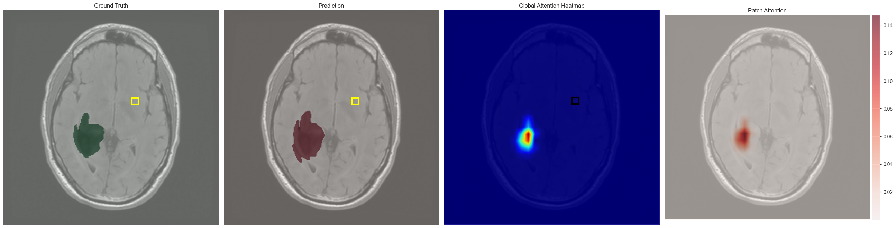
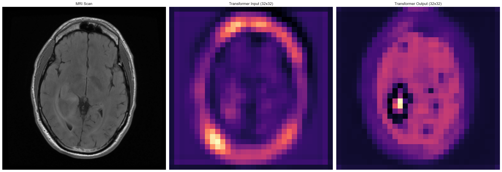

## Attention to Attention

We tried to analyze the attention mechanism inside the **transformer encoder** by figuring information it captures and how it is utilized during segmentation. To do this, we visualized the **self-attention matrix**.  

The transformer operates at the **bottleneck**, receiving a compact representation consisting of a **32×32 grid of patches**. For visualization, we selected a random **focal patch** from this grid and examined its attention map. This approach provides an **interpretable, patch-centric view** of how information flows through the attention mechanism.  

After inspecting many samples, we consistently observed the following patterns:

- **Focal patch inside a tumor region**:  
  

- **Focal patch outside a tumor region**:  
  

### Key Observation
The most important conclusion is that **regardless of the focal patch location, it consistently attends to the innermost section of the tumor**, often referred to by doctors as the **"tumor core"**. 

This observation provides insights into what might be encoded in the **Q and K matrices**:
- **Queries (Q)** may look for **core tumor patches**.  
- **Keys (K)** may encode whether a certain patch **contains this information**.  

From the attention scores, we can also learn about the contrast the keys and queries are sensitive to: 

- Tumor core patches are the **least attentive**.  
- Tumor patches outside the core are **moderate attentive** to the tumor core.  
- Non-tumor patches are the **most attentive** to the tumor core.  

This pattern suggests that the attention mechanism emphasizes **contrast between healthy and tumor tissue**, with the focal patch consistently focusing on the **tumor core** regardless of its own location.

---

### Input vs Output Visualization

Another useful visualization compares the energy maps of the **tensor coming into the transformer** and the **contextualized tensor coming out**:

  

This helps us interpret the role of the **Values (V)** matrix:

- The **tumor core** is **emphasized**.  
- The **edges of the tumor** (tumor - tumor_core) are **compressed**.  
- **Healthy brain patches** are also represented, but to a **lower degree** than the tumor core.  

These transformations effectively create a **“moat”** around the tumor, as seen in the third image above. This moat likely **establishes a clear boundary between tumor and healthy tissue**, which simplifies the job of the **upsampling CNN layers** that follow and improves segmentation performance.

For more visual examples: [`attention/figures`](figures)

Run visualization: [`attention/notebooks/attention_vis.ipynb`](notebooks/attention_vis.ipynb)